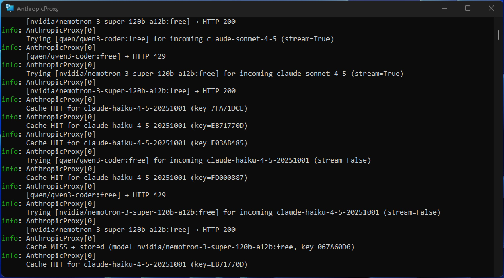
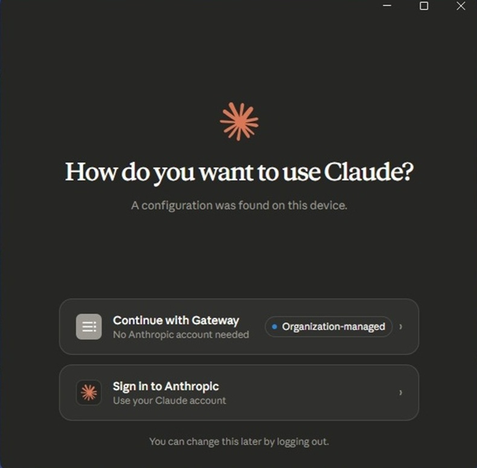
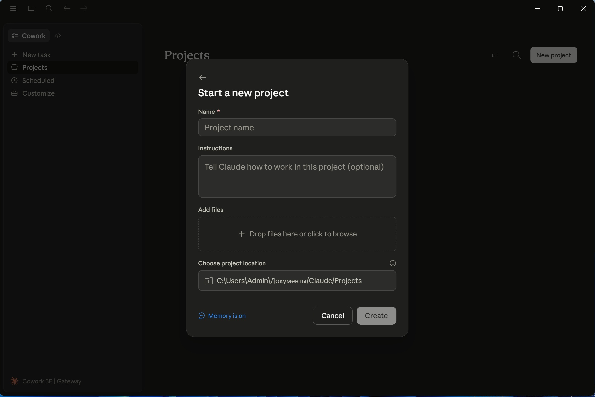
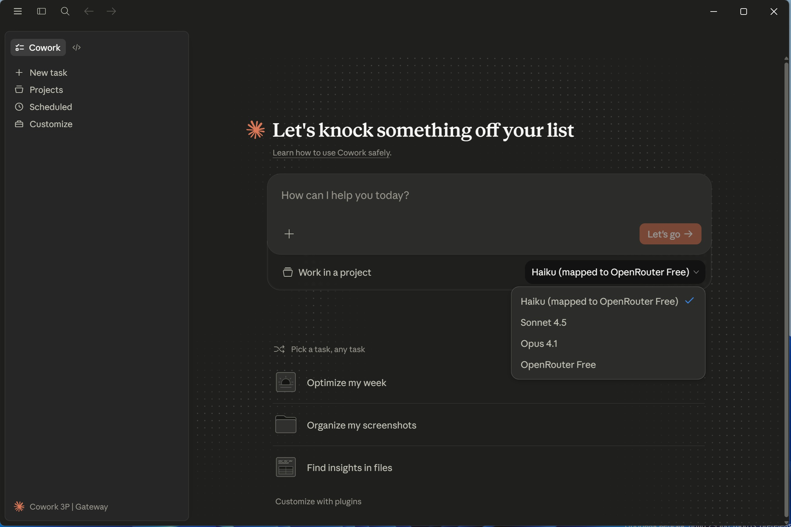
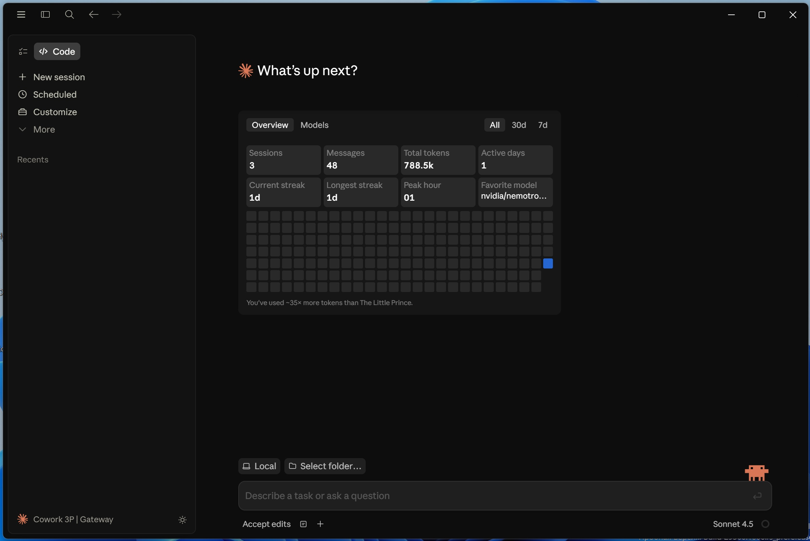
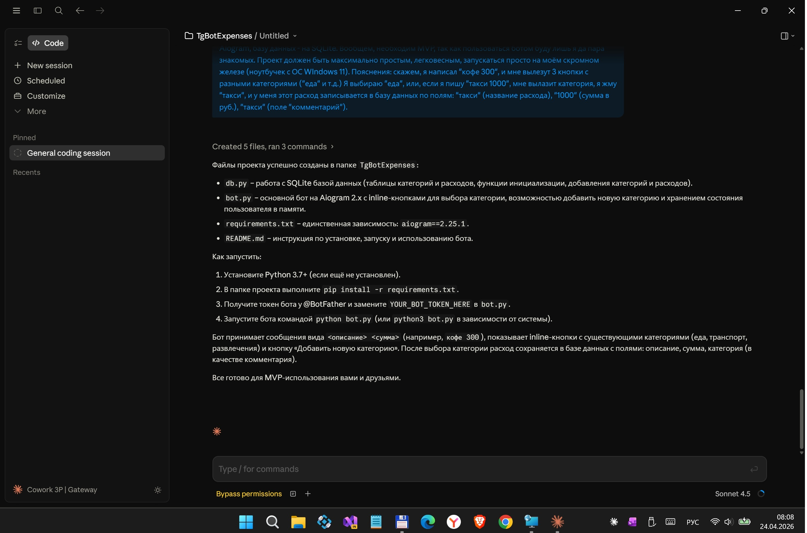

# AnthropicProxy 1.0.3


Небольшой локальный прокси на C# / ASP.NET Core, который позволяет запустить `Claude Desktop` в `gateway`-режиме и перенаправить запросы в OpenRouter.  Данная штука позволит прикоснуться к довольно хайповой штуковине Cloude и "потрогать" её неочевидные фичи Cowork и Code вообще без затрат. Важность отсутствия "фирменной" авторизации заметно тогда, когда аккаунт забанен Антропиком или на вашем тарифном плане исчерпаны все лимиты для продолжения взаимодействия с Cloude. По сути, "супермашина" Cloude Desktop с помощью этой прокси может какое-то дополнительное время (примерно 200 запросов в день)оработать с альтернативным "движком" Openrouter и его прикольными free-моделями (не так уж и уступающими хвалёным фирменным моделькам Opus или Sonnet из "фирменного набора" Anthropic). 

## Скриншоты

  




## Что нового / Ключевые изменения
Ключ читается в первую очередь из Proxy:OpenRouterApiKey в appsettings.json — пользователь просто вписывает его туда. Environment-переменная всё ещё работает как fallback (ASP.NET Core автоматически даёт ей приоритет если она задана, что удобно для продакшена).
record CachedResponse и вспомогательные функции перенесены в конец файла — после app.Run(), как и требует C# для top-level statements.
Модели meta-llama и google/gemma-3-27b-it:free убраны из дефолтного списка фолбэков, заменены на openai/gpt-oss-20b:free и openai/gpt-oss-120b:free — они поддерживают Anthropic-формат через OpenRouter и имеют 131K контекст.
При получении 400 или 404 модель автоматически добавляется в incompatibleModels прямо в рантайме — то есть если OpenRouter вдруг сменит поведение какой-то модели, прокси сам это обнаружит и больше не будет её трогать в рамках текущей сессии.


## Особенности этой наскоро собранной мини-софтинки
 
Текущий MVP специально сделан простым:

- отвечает на `GET /health`
- отвечает на `GET /v1/models`
- принимает `POST /v1/messages`
- принудительно маппит все клодовские модели на лучшие опенроутовские (я отобрал лучшие совершенно бесплатные моделис наибольшим контекстным окном и наиболее пригодные для коддинга)
- работает на Windows без Docker
- С# - исходники собираются через обычный .NET SDK (ASP.NET) и без Rust
- Без использования данного прокси в случае авторизации через учетные данные от сайта Anthropic (claude.ai) при использовании бесплатного тарифного плана (и, возможно, даже при использовании плана Pro) в десктопном приложении вместо вкладок Cowork и Code будет лишь вкладка Chat с довольно ограниченным применением. С "авторизацией" через Gateway этой прокси же Вы получаете возможность пользоваться одной из самых хайповых агентных оболочек (типа Codex) не боясь, что токены сгорят после первого же запроса :)
 

Важно: это экспериментальный проект, а не официальный продукт Anthropic или OpenRouter.

## Что уже умеет

- `Claude Desktop` видит локальный gateway и позволяет через этот gateway успешно авторизоваться
- запросы реально уходят в OpenRouter
- `stream=true`

## Что пока не реализовано

- тонкая совместимость работы фриварных моделек с `Claude Desktop` во вкладке Code вряд ли достигнута, т.к. Claude штука проприетарная  
- полноценная замена Haiku или Sonnet, конечно, не реализована (бесплатное есть бесплатное... и это лучше чем ничего)
- продвинутое логирование, retries и model capabilities

## Что потребуется

- Windows 10/11 x64
- .NET 8 SDK или новее
- установленный `Claude Desktop`
- OpenRouter API key

## Как запустить

### Вариант 1. Через `dotnet run`

1. Откройте PowerShell в папке проекта.
2. Задайте свой OpenRouter key:

```powershell
$env:OPENROUTER_API_KEY="ВАШ_OPENROUTER_API_KEY"
```

3. Запустите проект:

```powershell
dotnet run --launch-profile http
```

После запуска прокси будет слушать:

```text
http://127.0.0.1:3000
```

### Вариант 2. Через готовый exe (скачайте архив AnthropicProxy.zip в разделе Releases, затем распакуйте его, например, в C:\Apps\)

1. В папке AnthropicProxy найдите файл appsettings.json, а в нем строку 
```text
"OpenRouterApiKey": "PUT_YOUR_OPENROUTER_KEY_HERE"
```

Вместо "PUT_YOUR_OPENROUTER_KEY_HERE впишите свой api-ключ от сервиса OpenRouter.


2. Запустите powershell AnthropicProxy.exe


## Быстрая проверка, что прокси жив

Откройте второе окно PowerShell и выполните:

```powershell
Invoke-RestMethod -Uri "http://127.0.0.1:3000/health" -Method Get
```

Ожидаемый ответ:

```json
{
  "status": "ok"
}
```

Проверка списка моделей:

```powershell
Invoke-RestMethod -Uri "http://127.0.0.1:3000/v1/models" -Method Get
```

## Как включить `Claude Desktop` в gateway-режим

В репозитории есть два готовых файла:

- [desktop-gateway-enable.reg](./desktop-gateway-enable.reg)
- [desktop-gateway-disable.reg](./desktop-gateway-disable.reg)

### Перед включением сделайте резервную копию реестра через выполнение в PowerShell команды:

```powershell
reg export HKCU\SOFTWARE\Policies\Claude .\claude-policy-backup.reg /y
```

Если ветка ещё не существует, Windows может выдать ошибку. Это нормально.

### Включение

1. Полностью закройте `Claude Desktop`.
2. Убедитесь, что `AnthropicProxy` уже запущен.
3. Импортируйте настройки:

```powershell
reg import .\desktop-gateway-enable.reg
```

4. Снова запустите `Claude Desktop`.

После этого приложение должно увидеть локальный gateway и предложить вход через него.

## Как вернуть всё обратно

1. Закройте `Claude Desktop`.
2. Импортируйте файл отката:

```powershell
reg import .\desktop-gateway-disable.reg
```

3. Если хотите восстановить именно прежнее состояние ветки, а не просто удалить настройки gateway:

```powershell
reg import .\claude-policy-backup.reg
```

4. Снова запустите `Claude Desktop`.

## Как этим пользоваться каждый день

Самая простая схема такая:

1. Запустите `AnthropicProxy`
2. Дождитесь строки вроде:

```text
Now listening on: http://127.0.0.1:3000
```

3. Запустите `Claude Desktop`
4. Используйте `Cowork` / `Code`

Если прокси не запущен, `Claude Desktop` в gateway-режиме не сможет нормально работать.

## Почему в списке моделей могут быть странные подписи

Прокси сейчас отдаёт Anthropic-подобный список моделей, но по факту всё равно перенаправляет запросы в "аналоги" в openrouter.

Поэтому в интерфейсе можно увидеть, например:

- `Haiku`
- `Sonnet`
- `Opus`
- `OpenRouter Free`

Но реально все эти варианты сейчас маппятся в один и тот же upstream:

```text
openrouter/free
```

## Ограничения и известные нюансы

- некоторые free-модели OpenRouter могут возвращать ответы с reasoning-блоками или нестандартным содержимым
- для старых или облегчённых Windows-сборок может понадобиться включение `VirtualMachinePlatform`

## Безопасность

Если форкнули мой репозиторий и модифицировали его, то не публикуйте свой реальный OpenRouter API key в GitHub. Просто перед коммитом проверьте
 `Properties/launchSettings.json`.

В шаблоне этого проекта ключ в `launchSettings.json` уже заменён на безопасную заглушку.

## Лицензия и статус 

Используется стандартная лицензия MIT.
Проект находится в состоянии MVP / R&D. Используйте на свой страх и риск.

## .
Как есть. "Сделай сам", что называется. Код разработан с применением агентной IDE Codex и модели GPT-5.4 

## ..
Исследователь медиа, 2026
